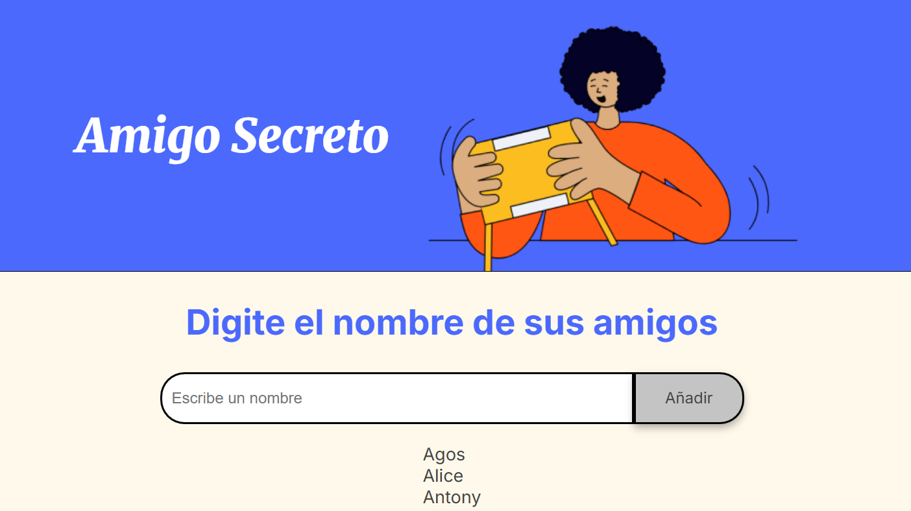

<h1>Proyecto amigo secreto</h1>
# Amigo Secreto

¡Bienvenidos al proyecto **Amigo Secreto**! Este es un juego simple donde puedes realizar el sorteo de **Amigo Secreto** de manera fácil y divertida.

## Descripción del Proyecto

En este proyecto puedes ingresar los nombres de tus amigos, el programa los ordena alfabeticamente y luego puedes hacer un sorteo aleatorio y ver quién te ha tocado como amigo secreto.

## Imágenes del Proyecto

### Pantalla principal del juego

### Ingreso de nombres

### Resultado del sorteo

## Cómo utilizar el proyecto

1. Abre el archivo `index.html` en tu navegador.
2. Ingresa los nombres de tus amigos.
3. Haz clic en **Añadir** para agregar más amigos.
4. Haz clic en **Sortear amigo** para ver el resultado.

## Tecnologías utilizadas

- **HTML**: Estructura básica del proyecto.
- **CSS**: Estilos de la interfaz.
- **JavaScript**: Lógica del sorteo.

